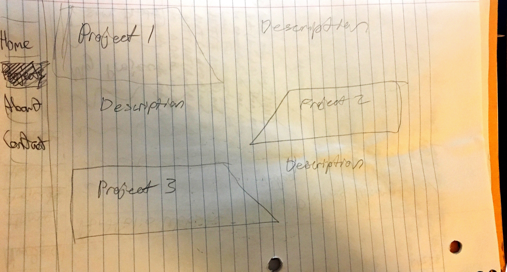
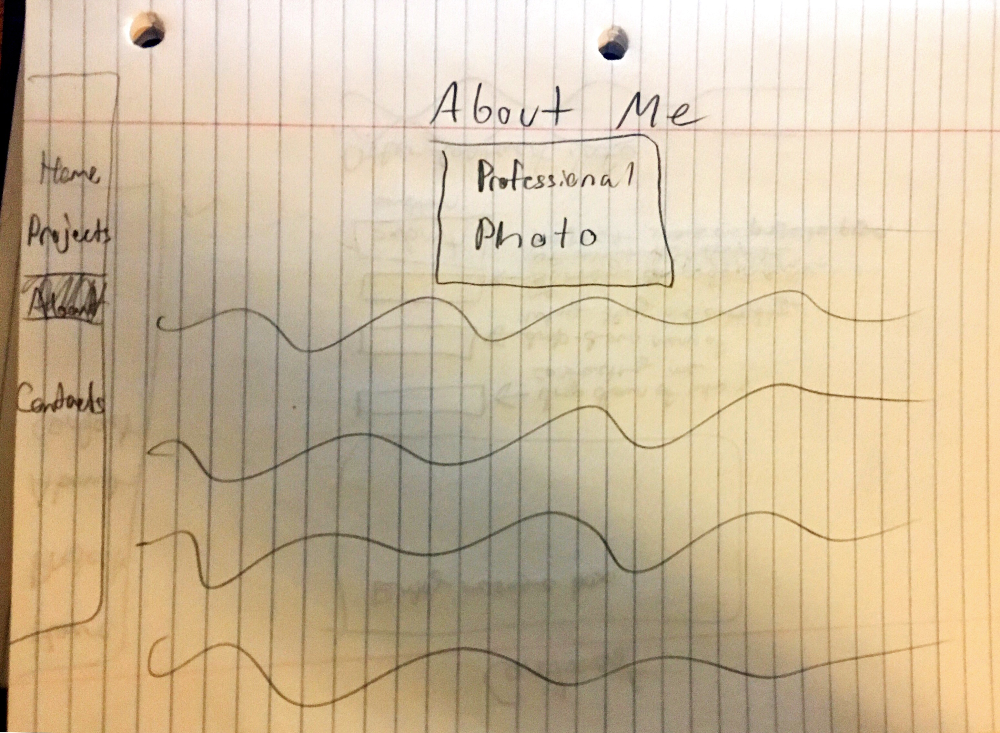
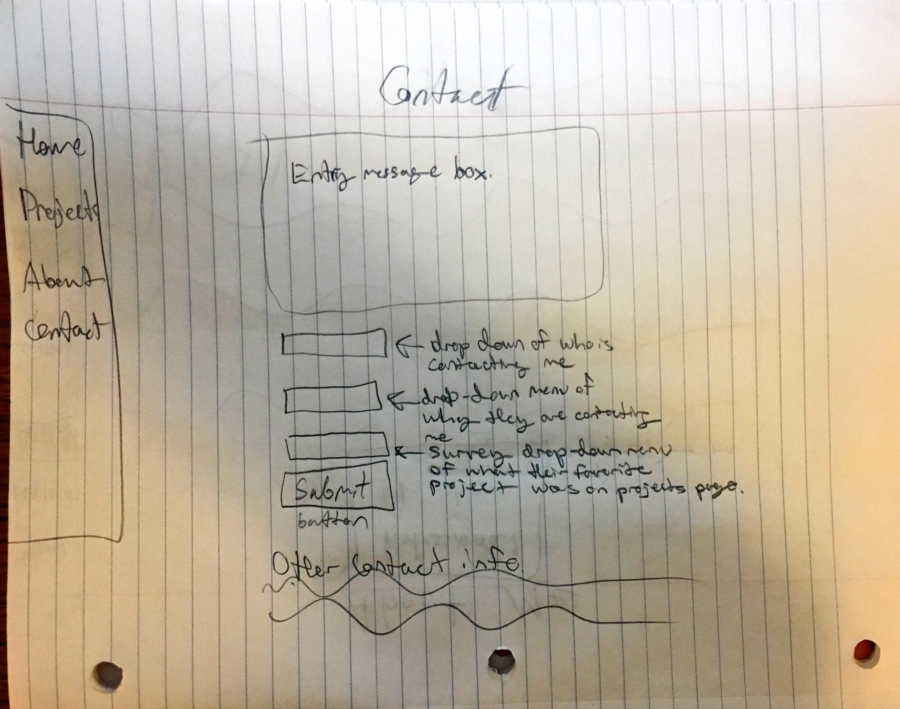
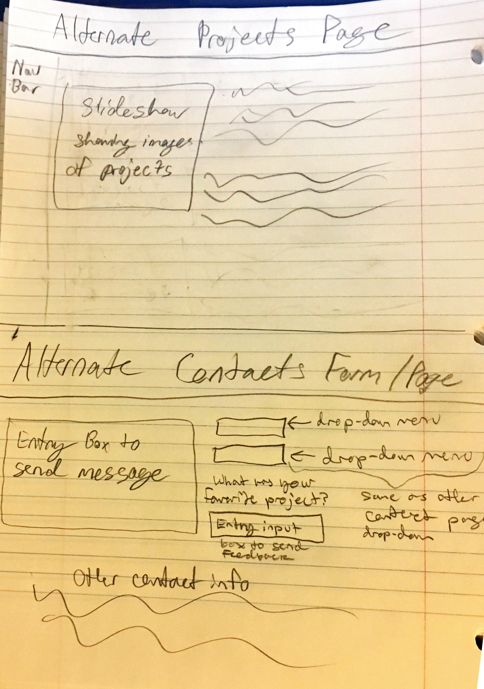
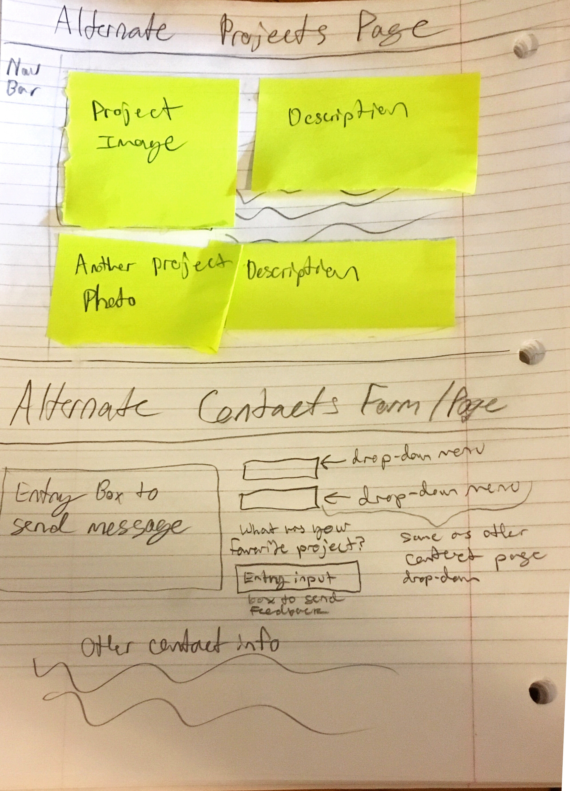
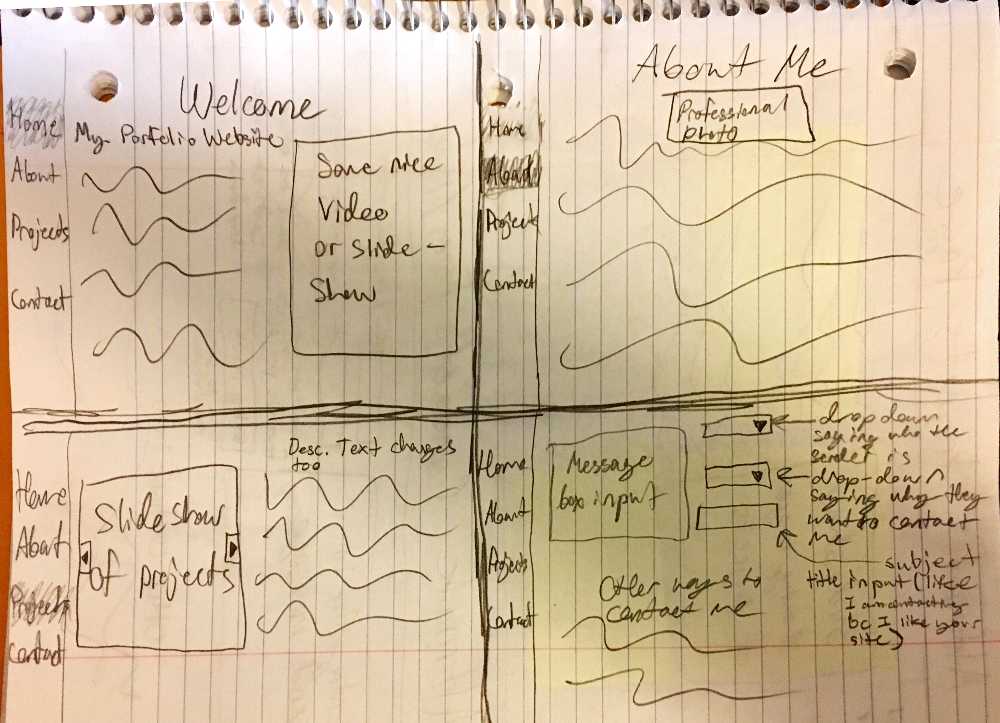
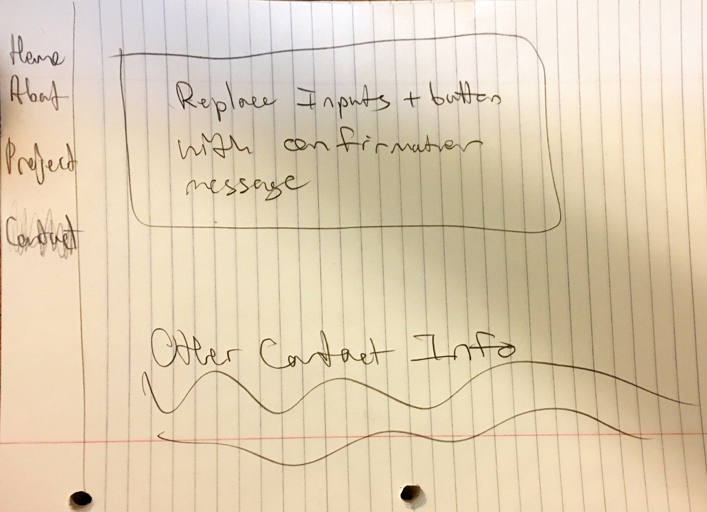
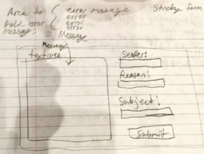

# Project 1: Design Journey

Your Name: Rose Zhou

**All images must be visible in Markdown Preview. No credit will be provided for images in your repository that are not properly linked in Markdown. Assume all file paths are case sensitive!**

# Project 1, Milestone 1 - Design & Plan

## Website Topic
This website will be about promoting my graphic design projects and other art hobbies. It will include a Home page, an About page, a Projects page displaying all my projects, and a Contact Page that has a sitcky form that allows people to contact me.

## Target Audiences
Target Audiences include possible companies who would want to sponsor me or specific projects, along with regular, typical people who would want to commission a specific art piece.

## Design Process

 I ended up liking these versions of the Project and Contact pages more.
 Moving around different sections and images.
## Final Design Plan
Final Designs:

Confirmation Page

Users will navigate to other pages using the navigation bar. Navigation bar contains Home, About, Projects, and Contacts tab to redirect to pages.

Home:
- Welcome message
- Some slideshow showing my work
- brief description

About:
- Title saying "About"
- Professional photo
- Description

Projects:
- Photos of each project in slideshow form
- Description of each project to match slideshow slide

Contacts:
- Contains the sticky form
- One input box for the message to send to me
- One drop down menu to select a choice saying who the user is
- One drop down menu to select the reason for why they are contacting me
- One input box for a brief subject title of the message
- Submit Button
- Other contact info probably placed at the bottom

## Target Audiences' Needs

By displaying my work and putting information in the about section about how I will do commissions or take sponsorships, I can communicate to companies that I am willing to do services for them and also sell products to regular customers (typical people). The contact page will allow messages from both companies and people on discussing what they would like to request.

## Templates

I will use a template for a navigation bar.
I will also use a template for the slideshow used on the home page and project page.

# Project 1, Milestone 2 - Draft Website

## Sticky Form

A text area will be used
3 other text inputs for sender,reasons for sending, and message subject

I will have red text pop out "You forgot message/reason/subject/sender"

## Validation Code Plan

 will have "if not empty" for all inputs and that will be enought to validate

# Final Submission: Complete & Polished Website

## Target Audiences

I had my design be very general in terms of addressing and informing my audience.
I mentioned whether you were a business or regular person, you were welcome to ask for a commission.

## Reflection

I really had trouble with the css, otherwise everything was fine! I just have to learn how to position things and maybe review that much more in depth.
